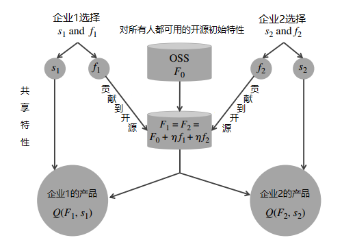

# 企业之间基于开源软件的竞争与合作

## 论文来源

### 《Competitive Strategy for Open Source Software》

* Vineet Kumar ：哈佛大学哈佛商学院，波士顿，马萨诸塞州，02163，vkumar@hbs.edu
* Brett R. Gordon ：哥伦比亚大学商学院，纽约，纽约，10027，brgordon@columbia.edu
* Kannan Srinivasan ：卡内基梅隆大学泰珀商学院，宾夕法尼亚州匹兹堡，15213，kannans@andrew.cmu.edu。

---

## 论文摘要

商业开源软件（COSS）产品 —— 基于公开源代码的私人开发的软件 —— 代表了一个快速增长、价值数十亿美元的市场。开源软件市场竞争的一个独特方面是，许多开源许可证要求企业公开某些增强功能，这就刺激了企业搭上他人贡献的便车。这种做法提出了一些令人费解的问题。首先，如果竞争者可以免费使用这些贡献，那么企业为什么要进一步开发产品？第二，一个基于免费搭车的市场如何产生高质量的产品？第三，从公共政策的角度来看，强制分享改进的做法是提高还是降低了消费者剩余和行业利润？

为了解决这些问题，我们建立了一个开源软件公司之间的双边（two-sided）竞争模型。我们的模型包括：（1）两家公司在一个垂直差异化的市场中竞争，其中产品质量是公开与私有成分的混合；（2）一个开发者市场，公司在观察到他们对开源贡献的信号后雇用他们。我们证明，在均衡中支持搭便车行为，强制分享的设置可以产生高质量的产品，而且搭便车实际上可以增加消费者剩余和行业利润。

---

## 模型一：私人和共享特征市场

---

## 模型二（1）：产品市场——私有特性开发模式

---

## 模型二（2）：产品市场——共享特性开发模式

---

## 模型的结论

* 在企业的竞争市场中
    * 强制分享的设置（类似于GPL的授权协议）可以产生高质量的产品
    * 积极贡献更多开源的企业，获得更加的竞争力
    * 在均衡中支持搭便车的行为，搭便车实际上可以增加消费者剩余与行业利润