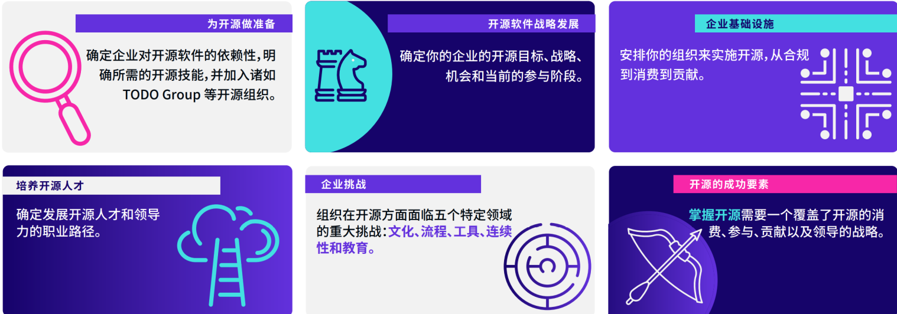

# 企业文化与开源文化

## 企业为开源采取的行动

---

## 什么是企业文化？

**组织文化（Organizational Culture）或者企业文化（Corporate Culture）** 是指一个组织由其共有的价值观、仪式、符号、处事方式和信念等内化认同表现出其特有的行为模式。可以观察到组织人员的行为规律、工作的团体规范、组织信奉的主要价值、指导组织决策的哲学观念等等。

在现代管理学里，这是一种企业主动通过一系列活动来塑造而成的文化形态，当这种文化被建立起来后，会成为塑造内部员工行为和关系的规范，是企业内部所有人共同遵循的价值观，对维系企业成员的统一性和凝聚力起很大的作用。

---

## 什么是开源文化？

李建盛：《[我们常说的开源文化，到底是什么？](https://opensourceway.community/posts/opensource_culture/what-is-open-source-culture-when-people-said/)》

* 开放与共享
* 代码风格、品味
* 沟通与协作
* 知识财产权的保护
* 开源软件的商业逻辑
* 价值观

---

## 开源社：《开源人宣言》

* 分享（Sharing）：乐于分享是一切善举的开端
* 开放（Openness）：公开透明是一切良好协作的基石
* 平等（Equality）：平等是社区健康的保障
* 协作（Collaboration）：开放式协作，逐步凝聚共识是社区繁荣的秘诀
* 创造美好世界（Build a better world）：创造更加美好的世界，是开源的终极追求

---

## 开源文化，是否能够改变企业文化？

### 或者说：企业文化是否能够更多的接纳开源文化？