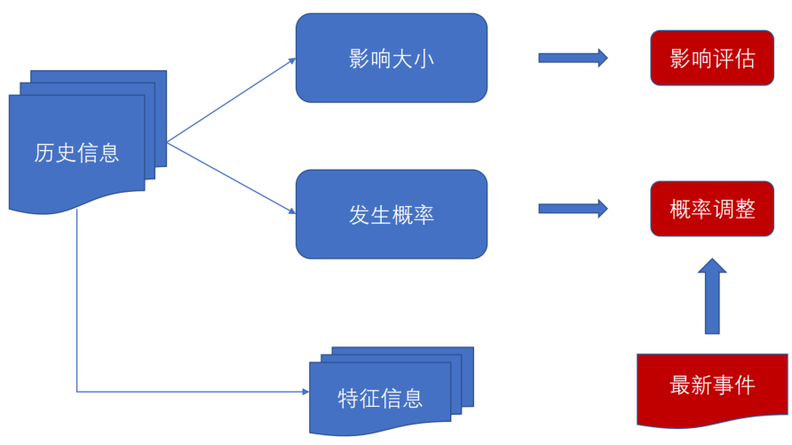
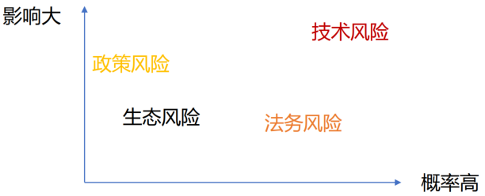

# 企业使用开源与供应链风险

## 如何研究开源供应链风险？

* 技术性风险
    * 代码bug
    * 安全漏洞
    * 恶意软件投毒
    * 网络阻断
* 法务风险
    * 未按照规律履行合规义务，导致诉讼风险
    * 开源软件修改License，开源转闭源
* 生态风险
    * 社区消亡，无人维护
    * 无法参与上游贡献
* 政策风险
    * 平台限制使用
    * 软件排除特定用户

---

## 如何评估开源供应链风险

---

## 如何应对开源供应链风险

* 风险排序： 技术风险 > 法务风险 > 政策风险 > 生态风险
* 区分企业投入还是社会投入
    * 企业投入：技术风险、法务风险
    * 社会投入：政策风险、生态风险
* 区分市场机制与公共能力
    * 市场机制：建设有利可图的服务
    * 公共服务：共建无利可图的服务