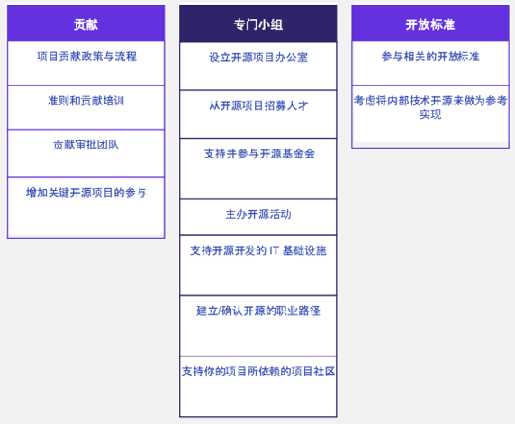
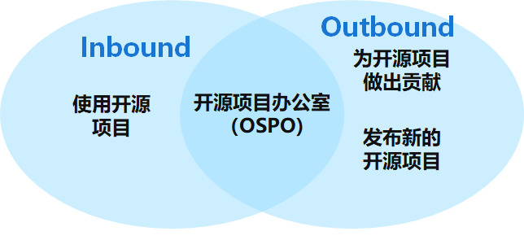

# 开源治理与OSPO

## 企业为什么要制定开源战略规划？

---

### 企业开源战略四大关注点

* 寻求参与的开源项目
* 希望密切联系的相关开源项目社区
* 开源治理的有效性
* 企业文化的开放性

---

## 实施企业开源治理的基础架构

开源战略需要构建基础架构来支持开源工程工作。
基础架构需要支持的四个关键支柱：

* 社区参与
* 开源贡献
* 开源合规性
* 开源消费

开源社区是唯一的项目治理平台，因为它涉及公司与公司所涉及的特定开源项目之间在使用、合规性和贡献方面的所有交互。 

---

## 开源消费与合规的基础设施

---

## 开源贡献基础设施

---

## 设立 OSPO——建立组织层面开源战略的抓手

OSPO（Open Source Program Office）即开源项目办公室，最早成立的公司为谷歌，成立于 2004 。此后，微软、Adobe、Netflix、Intel 等科技公司纷纷跟进成立企业 OSPO。OSPO 是企业实施开源战略的有效抓手，2013 年起中国企业也陆续开始组织建立自己的开源项目办公室。

---

## 企业开源的组织架构设置：开源项目办公室

### 开源项目办公室是什么？

在公司内部支持、培养、共享、解释和发展开源的组织架构；企业可以明确地建立和执行开源战略，为他们的领导者、开发人员、营销人员和其他员工提供他们需要的工具，使开源在运营中取得成功。

### 为什么需要开源项目办公室？

* 开源是一项战略优势，需要协调，集中和清晰的沟通，没有管理过程将会产生混乱和风险;
* 为了真正从开源中受益，需要透明和协作的文化。

---

### 开源项目办公室的职责

* 在公司内外沟通开源战略，监督战略的执行；
* 在商业产品和服务中促进开源的有效使用；
* 确保高质量和频繁地向开源社区发布代码；
* 与开发人员交流，使公司做出有效开源贡献；
* 在组织中培养开源文化；
* 维护开源许可的遵从性审查和监督。

---

### 开源项目办公室架构

* 取决于公司的主要业务和开源策略，它们可以位于首席技术官办公室等地方：
* 法律：开发人员可以就出现的问题与法律团队紧密合作。
* 工程：直接将精力集中在使开发人员的工作更加有效和富有成效上；
* 开发者关系/营销：使用开源来收集旨在销售使用开源构建的产品的销售线索。

---

## 企业实施开源战略的策略与回报

### 5C 策略原则：

* 消费（Consumption）
* 合规性（Compliance）
* 社区（Community）
* 贡献（Contribution）
* 竞争（Competition）

### 开源项目办公室收益

* 提高开发人员的敏捷性/速度 
* 更好更快地遵守许可证 
* 在开源之上建立差异化

### 开源作为营销策略

开源不仅仅是对源代码和口碑的共享，也是最佳的产品营销策略

---

### 开源的回报是获得竞争优势

哈佛商学院（Harvard Business School）的近期研究表明，开源贡献公司从开源中获取的生产价值比不回馈开源的公司高出100％。

