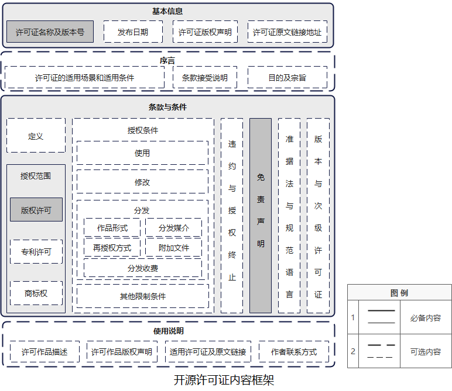
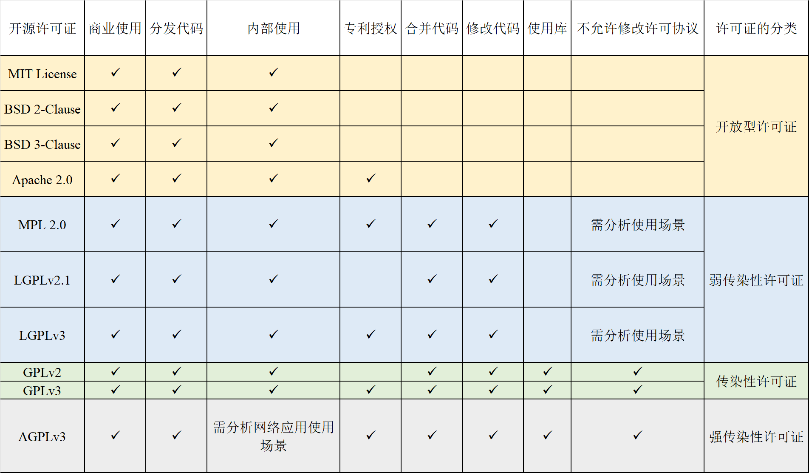

# 开源许可证对比

## 主要开源许可证介绍

常见的开源许可证主要有 Apache、MIT、BSD、GPL、LGPL、MPL、SSPL 等，可以大致分为两大类：宽松自由软件许可协议（“Permissive free software licence”）和著佐权许可证（“copyleft license”）。

Permissive free software licence 是一种对软件的使用、修改、传播等方式采用最低限制的自由软件许可协议条款类型。这种类型的软件许可协议将不保证原作品的派生作品会继续保持与原作品完全相同的相关限制条件，从而为原作品的自由使用、修改和传播等提供更大的空间。

而 Copyleft License 是在有限空间内的自由使用、修改和传播，且不得违背原作品的限制条款。如果一款软件使用 Copyleft 类型许可协议规定软件不得用于商业目的，且不得闭源，那么后续的衍生子软件也必须得遵循该条款。

------

## 主要开源许可证介绍

两者最大的差别在于：在软件被修改并再发行时， Copyleft License 仍然强制要求公开源代码（衍生软件需要开源），而 Permissive free software licence 不要求公开源代码（衍生软件可以变为专有软件）。

其中，Apache、MIT、BSD 都是宽松许可证，GPL 是典型的强著佐权（copyleft ）许可证，LGPL、MPL 是弱著佐权（copyleft ）许可证。SSPL 则是近年来 MongoDB 创建的一个新许可证，存在较大争议，开放源代码促进会 OSI 甚至认为 SSPL 就不是开源许可协议。

---

## 选择许可证的简单逻辑

来源：[https://www.ruanyifeng.com/blog/2011/05/how_to_choose_free_software_licenses.html](https://www.ruanyifeng.com/blog/2011/05/how_to_choose_free_software_licenses.html)

------

补充说明：

* 无论哪一个许可证 都不默认能用作者名字促销，除非是明示可以使用 
* BSD、Apache、GPL都有多个版本，也有区别

---

## 更加复杂的许可证知识

---

## 另一个参考资源：https://tldrlegal.com/

* GPL v3
    * Can
        * Commercial Use
        * Modify
        * Distribute
        * Place Warranty
        * Use Patent Claims
    * Cannot
        * Sublicense
        * Hold Liable
    * Must
        * Include Original
        * State Changes
        * Disclose Source
        * Include License
        * Include Copyright
        * Include Install Instructions

---

* Apache V2
    * Can
        * Commercial Use
        * Modify
        * Distribute
        * Sublicense
        * Private Use
        * Use Patent Claims
        * Place Warranty
    * Cannot
        * Hold Liable
        * Use Trademark
    * Must
        * Include Copyright
        * Include License
        * State Changes
        * Include Notice

---

* MIT License
    * Can
        * Commercial Use
        * Modify
        * Distribute
        * Sublicense
        * Private Use
    * Cannot
        * Hold Liable
    * Must
        * Include Copyright
        * Include License

---

### 常见开源许可证的特性

​	判断许可证之间是否兼容，我们要先识别影响开源许可证兼容性的特性，通过分析常见许可证的官方原件，其特性列表如下所示。特性解释：

* 商业使用：该许可证下的代码和衍生品可以用于商业目的。
* 分发代码：该许可证下的代码可以被分发给第三方。
* 内部使用：该许可证允许修改源代码后在个人及组织内部使用，不必向外部分发。
* 专利授权：该许可证明确提出提供专利授权。
* 合并/修改代码：从要组合的开源软件中取出整体/部分代码，修改或不修改都可以，然后把它添加到你的代码中构成一个作品，分发时必须提供源代码。
* 使用库：在编译或运行时通过链接、导入或其他典型的机制（例如静态与动态链接）把开源代码与自有代码绑定在一起后，自有代码分发时必须提供源代码。
* 不允许修改许可协议：当使用“合并、修改、使用库”等方式组合开源代码与自有代码后，不允许自有代码使用不兼容的开源许可协议或闭源分发。

---

---

## 专利相关规定

|许可证类型|BSD, MIT，Apache1.1， Artistic1.0|Apache v2, Artistic v 2|MPL v1.1，CDDLv1 ，MPLv2，EPLv1|GPLv2, LGPLv2, AGPLv2|GPLv3, LGPLv3, AGPLv3|
|---|---|---|---|---|---|
|用户对下游用户的专利许可范围|无规定|主动贡献；主动贡献与原始软件的结合(结合侵权)|修改部分|主文说明不得对下游用户获得的权利进行限制|分发的GPL软件|
|软件所有者对用户的专利许可范围|无规定|原始软件|原始软件|仅序言说专利须免费许可|原始软件|

## 专利相关规定

|许可证类型|BSD, MIT，Apache1.1， Artistic1.0|Apache v2, Artistic v 2|MPL v1.1，CDDLv1 ，MPLv2，EPLv1|GPLv2, LGPLv2, AGPLv2|GPLv3, LGPLv3, AGPLv3|
|---|---|---|---|---|---|
|不诉限制|无规定|用户不得就该软件专利侵权（含交叉诉和反诉）否则本软件下的专利许可终止|用户不得起诉任何人该软件专利侵权，否则所有许可终止，不同许可证对交叉诉和反诉的排除不同。|无|用户不得起诉该软件专利侵权，否则所有许可终止。|
|对获得第三方许可的限制|无规定|无|无|要获得无限制的给所有开源软件用户的软件专利许可。但通过对集成软件的产品获得专利许可可规避|要获得无限制的给所有开源软件用户的专利许可。通过集成软件的硬件获取对自己的专利许可可规避，但为客户买前述专利许可则不能规避。|
|对应软件（举例）|Allseen|OPNFV；OpenStack|opendaylight|Linux|最新版本的GCC编译器|