# 开源技术选型

## 开源技术使用中的问题

* 开源组件的选型
    * 某一领域，如何选择活跃与健康的项目
* 开源组件的合规
    * 开源项目许可证的兼容与冲突检测
    * 开源代码的违规复用
* 开源供应链风险与安全
    * 开源组件在供应链中的监测与预警
    * 开源组件供应链的重构与优化

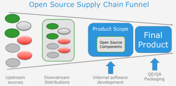

---

## 开源技术选型框架

* 功能满足度
    * 分析业务应用的各种场景，各种业务场景的满足度如何。
    * 性能满足度如何。
    * 是否易于测试。
    * 涉及到行业规范的，行业规范遵行度如何。
* 学习成本分析
    * API参考、开发指南等资料文档是否齐全。
    * 分析开源框架代码量，依赖其他的开源框架的量。优先使用轻量级的框架。
    * 开源社区活跃度如何。优先使用主流的框架。

---

## 开源技术选型框架--续

* 开源风险分析
    * 优先使用开源协议友好的项目
    * 活跃度：使用活跃的开源项目
* 集成开发成本
    * 分析集成的难易程度，优先使用入侵项目代码少的，集成方式解耦的框架。
    * 基于开源框架扩展新功能的工作量分析，尽量覆盖各种开发场景。
    * 相关的能力是否开放，是否方便定制。
* 维护成本
    * 开源框架升级是否支持平滑升级。
    * 开源框架接不同版本之间的兼容性如何。
    * 日志是否丰富，是否有性能统计日志等方便在网维护。

---

## 基于数据指标的开源技术选型方法

* 开发活跃度
* 项目影响力
* 社区健康度
* 社区持续发展指数
* ……

---

## 方法：基于开源测量学的开源生态分析

* 宏观洞察：
    * 开源持续升温，规模、活跃度、多样性
    * 开源产业链不断完善，渗透全行业
    * 开源供应链极具规模，极具战略意义
* 中观洞察：
    * 技术多样性快速发展，中美对比分析
    * 企业快速布局开源，企业排行与分析
    * 基金会中流砥柱，旗下领域发展与分析
* 微观洞察：
    * 国外开源项目排行、国内开源项目排行
    * 开发者排行，机器人排行，洞察
    * 深度开源案例分析
    * GitHub 趋势榜每月之星

---

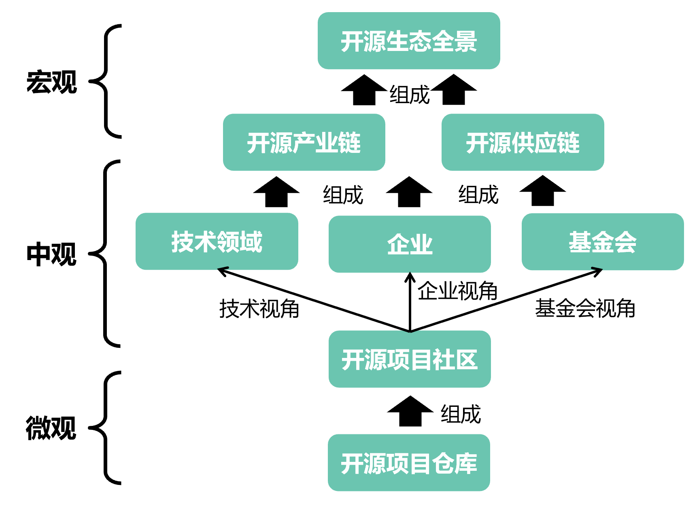

---

## 开发者行为数据是一个极好的切入点

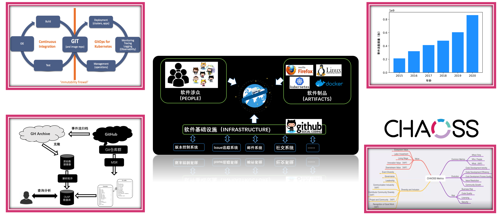

---

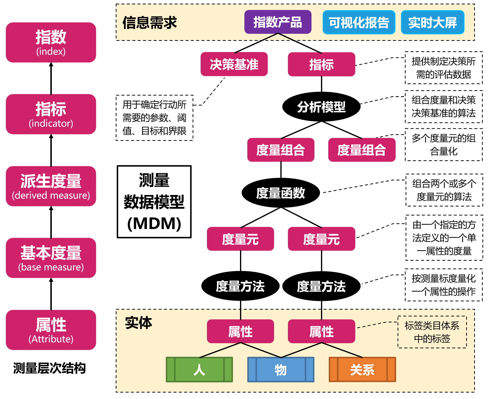

---

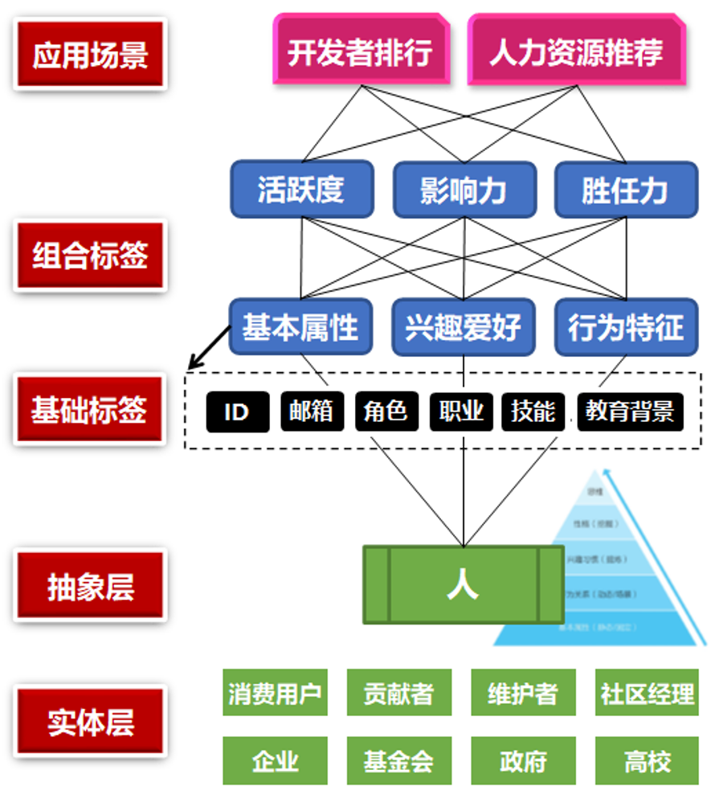

---

---

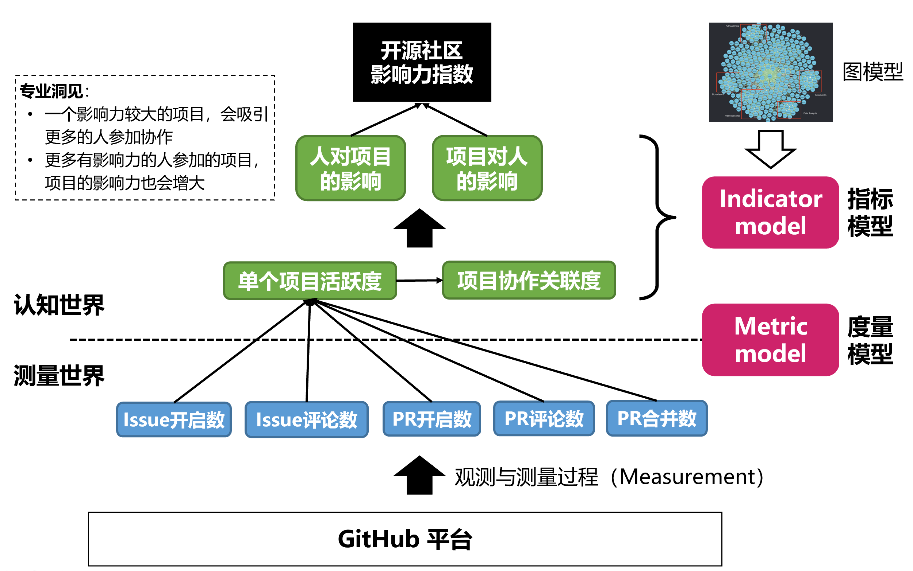

---

## 开源生态数据类目体系

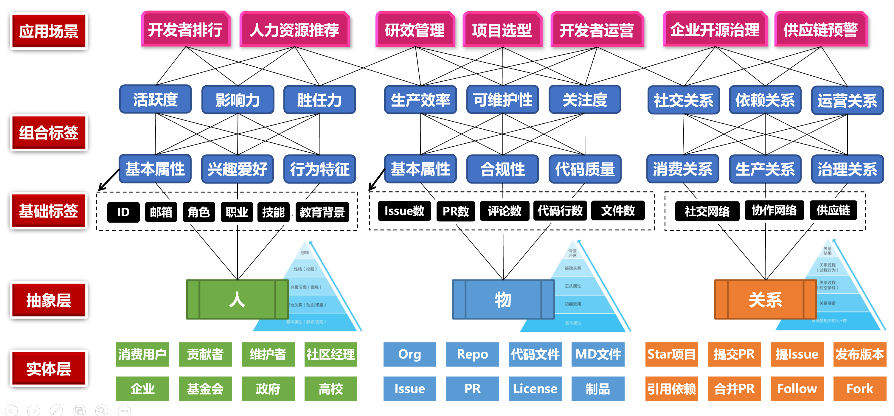

---

## 选型：开源技术的数字化洞察

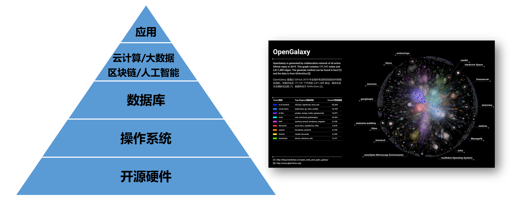

---

## 开源基础软件 —— 数据库

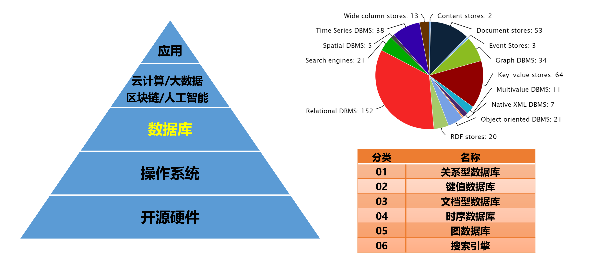

---

## 关系型数据库

---

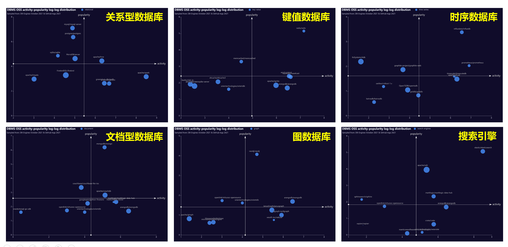

---

## 数据库领域的开源象限

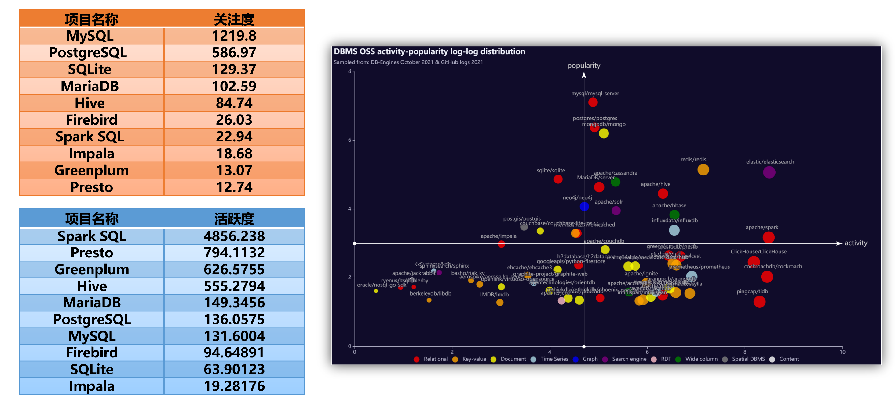

---

## 开源科技的数字化洞察 —— 云原生

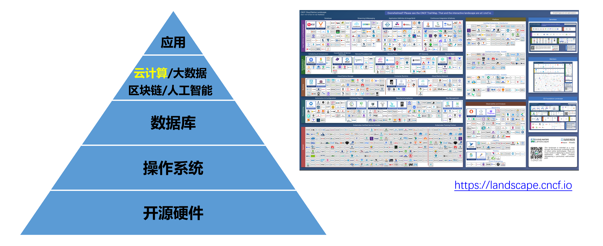

---

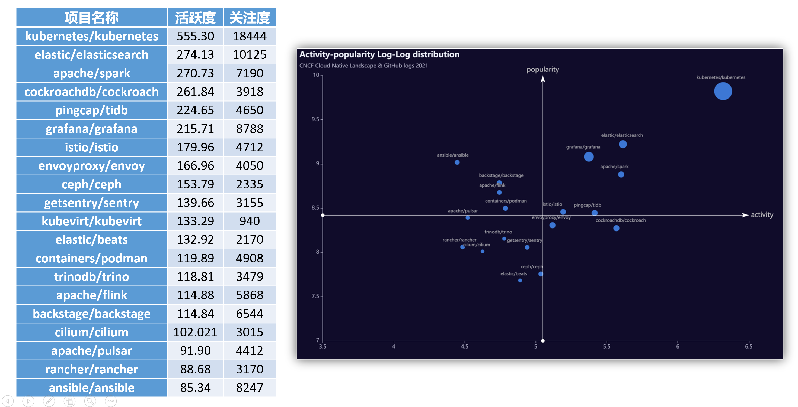

---

## 案例分析：VSCode

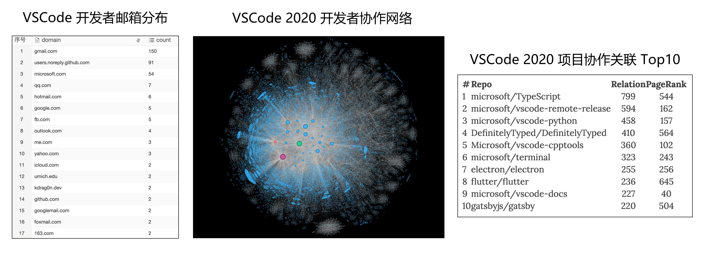

---

## VSCode 案例分析之社区流程

* build-chat：将构建信息发送到 Slack 中
* classifier/classifier-deep：Issue 自动打标/基于机器学习
* copycat：跨仓库 Issue 拷贝
* english-please：非英文开 Issue 提示使用英文
* locker：Issue 关闭一段时间后自动锁定
* regex-labeler：根据 Issue 描述中正则匹配结果打标签
* topic-subscribe：根据 label 提醒某些账户关注当前 Issue

其他注重流程的社区：Kubernetes、React、OpenDigger 等

---

## 案例分析：TiDB 开源生态初探

* Tidb、Tikv 生态与云原生生态项目联系紧密；
* 贡献者会贯彻 upstream first 原则；
* PingCAP 具有较为完整的社区和项目生命周期管理的设计；
* 不仅有 pingcap 和 tikv 两个主要组织，还包括 pingcap-incubator 的项目孵化组织，还有 tidb-challenge-program 组织用于一些技术攻关项目的研发；
* PinCAP 高度重视自动化测试，chaos-mesh 为其自主研发的混沌工程项目；
* PingCAP 内部大量使用机器人自动化协作。

---

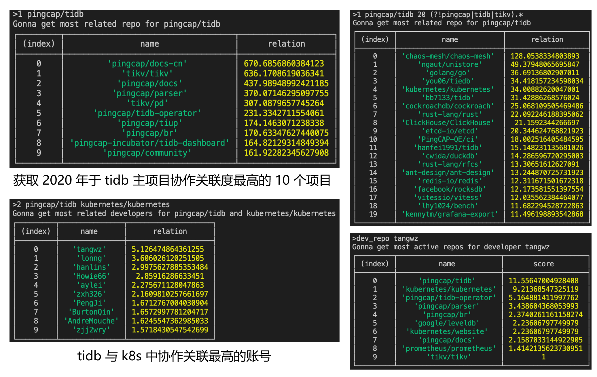

---

## 企业内部的开源使用责任矩阵

* 开源管理委员会
    * 开源技术委员会
        * 开源技术专项委员会：负责为某一领域的技术，制定使用规则
* BG
    * BU
        * 开源Owner：负责看护某一款开源软件的各个版本
* 版本火车Owner：负责组织一组开源软件版本，组成“火车”
    * 开源Owner
        * 开源Commmitter：负责开发、维护开源软件
* 其他专项工作
    * 架构师：参与选型决策
    * 安全工程师：参与选型决策，提供安全建议
    * 法务人员：参与选型决策