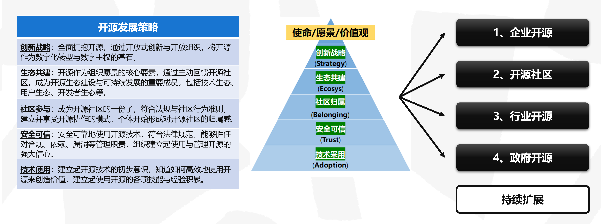
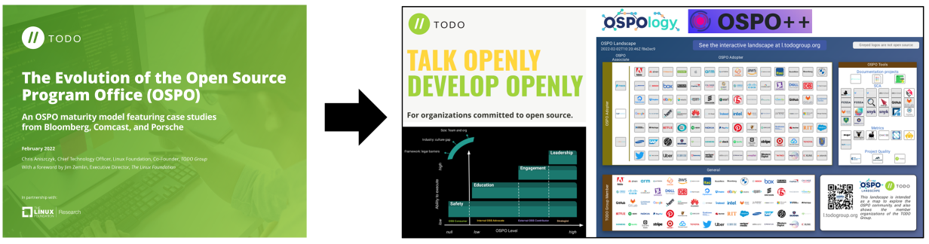
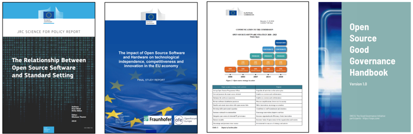
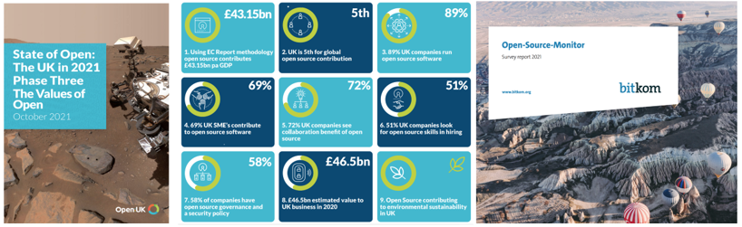
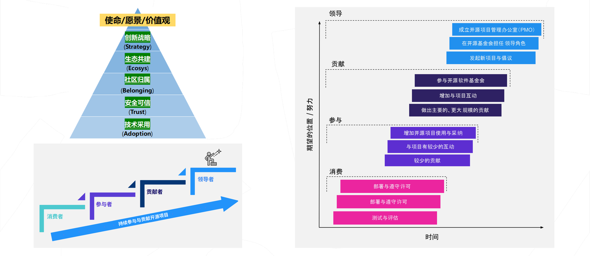
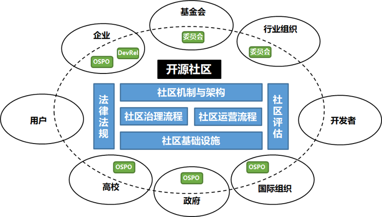
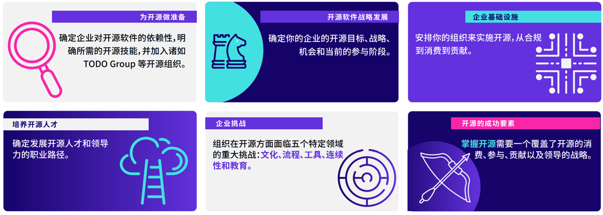

# 从企业看开源

## 开源发展策略的共识

---

## 全球企业开源发展路线

### Linux基金会的运作

### TODO Group 的运作

---

## 欧盟的开源发展路线

---

## 企业参与开源的不同阶段

---

## 从开源社区视角看企业参与开源

* **自由职业者**：追求个人兴趣与价值的实现；
* **商业组织**：追求长期价值创造和业务利润转化，通过贡献获得回报，并推动开源生态发展；
* **基金会**：追求开源生态的健康与可持续性发展；
* **政府**：在一个地区或地方，拥有法定的权力，追求公平的繁荣；
* **事业组织**：教育科研机构、行业学会等，追求每个组织的宗旨与使命；
* **国际组织**：国际协会、区域组织等，致力于公平、安全、稳定的可持续发展；
* **用户**：社区提供的开源项目的使用方，追求长期、可持续、稳定可靠的开源组件。

---

## 企业为开源采取的行动

